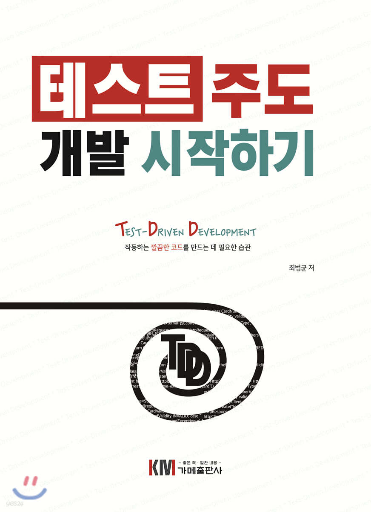

## 테스트 주도 개발 시작하기 : Test-Driven Development

### 구매 링크

https://m.yes24.com/Goods/Detail/89145195

### 책에 대한 소개

해당 책은
TDD 라는게 뭔지 , 왜 좋은지 , 어떻게 시작해야하는지에
대해서 단계별로 알려주는 책이다

테스트에 대해 잘 모르는 사람들이나
TDD에 대해서 잘 모르는 사람들이면 좋은 내용

### 목차
##### [3강 - 테스트 코드 작성 순서](https://github.com/youngsu5582/archive/blob/d6d53baf59670566b7ca2bf95198e51d7c13f65f/%EB%8F%84%EC%84%9C/%ED%85%8C%EC%8A%A4%ED%8A%B8%20%EC%A3%BC%EB%8F%84%20%EA%B0%9C%EB%B0%9C%20%EC%8B%9C%EC%9E%91%ED%95%98%EA%B8%B0/%ED%85%8C%EC%8A%A4%ED%8A%B8%20%EC%A3%BC%EB%8F%84%20%EA%B0%9C%EB%B0%9C%20%EC%8B%9C%EC%9E%91%ED%95%98%EA%B8%B0%20-%203%EA%B0%95.md)
##### [4강 - TDD·기능 명세·설계](https://github.com/youngsu5582/archive/blob/d6d53baf59670566b7ca2bf95198e51d7c13f65f/%EB%8F%84%EC%84%9C/%ED%85%8C%EC%8A%A4%ED%8A%B8%20%EC%A3%BC%EB%8F%84%20%EA%B0%9C%EB%B0%9C%20%EC%8B%9C%EC%9E%91%ED%95%98%EA%B8%B0/%ED%85%8C%EC%8A%A4%ED%8A%B8%20%EC%A3%BC%EB%8F%84%20%EA%B0%9C%EB%B0%9C%20%EC%8B%9C%EC%9E%91%ED%95%98%EA%B8%B0%20-%204%EA%B0%95.md)
##### [5강 - JUnit 5 기초](https://github.com/youngsu5582/archive/blob/d6d53baf59670566b7ca2bf95198e51d7c13f65f/%EB%8F%84%EC%84%9C/%ED%85%8C%EC%8A%A4%ED%8A%B8%20%EC%A3%BC%EB%8F%84%20%EA%B0%9C%EB%B0%9C%20%EC%8B%9C%EC%9E%91%ED%95%98%EA%B8%B0/%ED%85%8C%EC%8A%A4%ED%8A%B8%20%EC%A3%BC%EB%8F%84%20%EA%B0%9C%EB%B0%9C%20%EC%8B%9C%EC%9E%91%ED%95%98%EA%B8%B0%20-%205%EA%B0%95.md)
##### [6강 - 테스트 코드의 구성](https://github.com/youngsu5582/archive/blob/d6d53baf59670566b7ca2bf95198e51d7c13f65f/%EB%8F%84%EC%84%9C/%ED%85%8C%EC%8A%A4%ED%8A%B8%20%EC%A3%BC%EB%8F%84%20%EA%B0%9C%EB%B0%9C%20%EC%8B%9C%EC%9E%91%ED%95%98%EA%B8%B0/%ED%85%8C%EC%8A%A4%ED%8A%B8%20%EC%A3%BC%EB%8F%84%20%EA%B0%9C%EB%B0%9C%20%EC%8B%9C%EC%9E%91%ED%95%98%EA%B8%B0%20-%206%EA%B0%95.md)
##### [7강 - 대역](https://github.com/youngsu5582/archive/blob/d6d53baf59670566b7ca2bf95198e51d7c13f65f/%EB%8F%84%EC%84%9C/%ED%85%8C%EC%8A%A4%ED%8A%B8%20%EC%A3%BC%EB%8F%84%20%EA%B0%9C%EB%B0%9C%20%EC%8B%9C%EC%9E%91%ED%95%98%EA%B8%B0/%ED%85%8C%EC%8A%A4%ED%8A%B8%20%EC%A3%BC%EB%8F%84%20%EA%B0%9C%EB%B0%9C%20%EC%8B%9C%EC%9E%91%ED%95%98%EA%B8%B0%20-%207%EA%B0%95.md)
##### [8강 - 테스트 가능한 설계](https://github.com/youngsu5582/archive/blob/d6d53baf59670566b7ca2bf95198e51d7c13f65f/%EB%8F%84%EC%84%9C/%ED%85%8C%EC%8A%A4%ED%8A%B8%20%EC%A3%BC%EB%8F%84%20%EA%B0%9C%EB%B0%9C%20%EC%8B%9C%EC%9E%91%ED%95%98%EA%B8%B0/%ED%85%8C%EC%8A%A4%ED%8A%B8%20%EC%A3%BC%EB%8F%84%20%EA%B0%9C%EB%B0%9C%20%EC%8B%9C%EC%9E%91%ED%95%98%EA%B8%B0%20-%208%EA%B0%95.md)
##### [9강 - 테스트 범위와 종류](https://github.com/youngsu5582/archive/blob/d6d53baf59670566b7ca2bf95198e51d7c13f65f/%EB%8F%84%EC%84%9C/%ED%85%8C%EC%8A%A4%ED%8A%B8%20%EC%A3%BC%EB%8F%84%20%EA%B0%9C%EB%B0%9C%20%EC%8B%9C%EC%9E%91%ED%95%98%EA%B8%B0/%ED%85%8C%EC%8A%A4%ED%8A%B8%20%EC%A3%BC%EB%8F%84%20%EA%B0%9C%EB%B0%9C%20%EC%8B%9C%EC%9E%91%ED%95%98%EA%B8%B0%20-%209%EA%B0%95.md)
##### [10강 - 테스트 코드와 유지보수](https://github.com/youngsu5582/archive/blob/d6d53baf59670566b7ca2bf95198e51d7c13f65f/%EB%8F%84%EC%84%9C/%ED%85%8C%EC%8A%A4%ED%8A%B8%20%EC%A3%BC%EB%8F%84%20%EA%B0%9C%EB%B0%9C%20%EC%8B%9C%EC%9E%91%ED%95%98%EA%B8%B0/%ED%85%8C%EC%8A%A4%ED%8A%B8%20%EC%A3%BC%EB%8F%84%20%EA%B0%9C%EB%B0%9C%20%EC%8B%9C%EC%9E%91%ED%95%98%EA%B8%B0%20-%2010%EA%B0%95.md)
##### [11강 - 마치며](https://github.com/youngsu5582/archive/blob/d6d53baf59670566b7ca2bf95198e51d7c13f65f/%EB%8F%84%EC%84%9C/%ED%85%8C%EC%8A%A4%ED%8A%B8%20%EC%A3%BC%EB%8F%84%20%EA%B0%9C%EB%B0%9C%20%EC%8B%9C%EC%9E%91%ED%95%98%EA%B8%B0/%ED%85%8C%EC%8A%A4%ED%8A%B8%20%EC%A3%BC%EB%8F%84%20%EA%B0%9C%EB%B0%9C%20%EC%8B%9C%EC%9E%91%ED%95%98%EA%B8%B0%20-%2011%EA%B0%95.md)

### 느낀점

네오의 강의도 듣고 , 다양한 TDD 영상을 찾아보고
이 책을 읽어 보았다

아직까지도 , TDD 맹신론자는 되지 못할 거 같다

하지만 TDD가 왜필요한지 , TDD가 어떤 장점을 주는지에 대해서는
좀 더 알게된 느낌이다
##### 왜 필요한가?

인간은 한 번에 한 가지 일을 하는게 가장 효율적이다

테스트를 나중에 짤 필요가 없다

처음에 쓰레기 같이 코드를 짜기에 필연적으로 리팩토링을 한다
##### 어떤 장점을 주는가?

다양한 예제를 테스트 할 시간을 준다

나중에 다른 코드를 건들려도 "회귀 테스트" 를 진행할 수 있게 해준다

난이도 어려운 테스트를 진행하며 개발 실력을 키워나갈 수 있다

Shall We TDD?